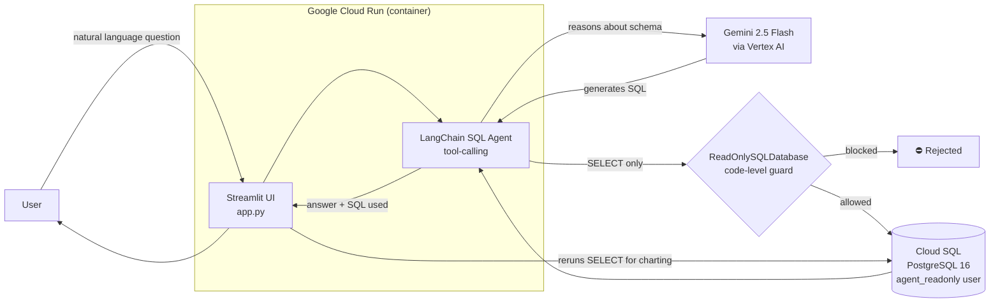

# Intelligent Site Services Copilot

A natural-language AI agent that lets non-technical staff query a PostgreSQL database — equipment fleet, projects, permits, clients, aggregate inventory — using plain English (or Portuguese) questions instead of SQL.

Built as a portfolio project to demonstrate applied LLM engineering: agentic SQL generation, defense-in-depth security around a database-connected agent, and a production deployment on Google Cloud.

**🔗 Live demo:** https://site-services-copilot-320339449894.us-central1.run.app

> Ask things like *"How many excavators are available right now?"* or *"List projects with pending permits"* and get a natural-language answer, the generated SQL, and — when the result is tabular — an auto-generated chart.

---

## Table of Contents

- [Architecture](#architecture)
- [Tech Stack](#tech-stack)
- [Security Model](#security-model)
- [Database Schema](#database-schema)
- [Running Locally](#running-locally)
- [Deployment](#deployment-google-cloud-run)
- [Design Decisions & Trade-offs](#design-decisions--trade-offs)
- [Roadmap / Possible Extensions](#roadmap--possible-extensions)

---

## Architecture



**Request flow:**
1. User asks a question in the Streamlit chat UI.
2. A LangChain `create_sql_agent` (tool-calling agent) inspects the database schema and decides which SQL query answers the question.
3. Gemini 2.5 Flash (called via Vertex AI, no API key — identity-based auth) generates the SQL.
4. Before hitting the database, every query passes through a **read-only guard** implemented in code (see [Security Model](#security-model)).
5. The result comes back through the agent, which formats a natural-language answer.
6. The UI also surfaces the **exact SQL that was run** and, when the result has numeric columns, renders an automatic chart.

---

## Tech Stack

| Layer | Technology |
|---|---|
| LLM | Gemini 2.5 Flash (Google Vertex AI) |
| Agent framework | LangChain (`create_sql_agent`, tool-calling) |
| Frontend | Streamlit |
| Database | PostgreSQL 16 (Cloud SQL in production, Docker locally) |
| DB connectivity (prod) | Cloud SQL Python Connector (`pg8000`, no public IP, no proxy) |
| Data / charts | pandas, `st.bar_chart` / `st.line_chart` |
| Deployment | Google Cloud Run (containerized, built via Cloud Build) |
| Secrets | Google Secret Manager |
| IAM | Dedicated Cloud Run service account (`aiplatform.user` + `cloudsql.client`, least-privilege) |

---

## Security Model

Running an LLM agent with direct database access is inherently risky — the model can be prompted into generating destructive SQL. This project uses **defense-in-depth**: two independent layers, so a failure in one doesn't compromise the database.

1. **Database-level:** a dedicated Postgres role, `agent_readonly`, is granted `SELECT` only, with default privileges also restricted to `SELECT` for any future tables. `INSERT`/`UPDATE`/`DELETE`/`TRUNCATE` are explicitly revoked. Even a full prompt-injection compromise of the LLM cannot write to the database, because the database user itself is incapable of writing.
2. **Application-level:** a `ReadOnlySQLDatabase` class wraps LangChain's `SQLDatabase` and rejects, in code, any query that doesn't start with `SELECT` or that contains destructive keywords (`insert`, `update`, `delete`, `drop`, `alter`, `truncate`, `create`, `grant`, `revoke`) — before the query ever reaches Postgres.

Additional production hardening:
- Database credentials are never hardcoded — they're injected via **Google Secret Manager** at deploy time.
- The Cloud Run service runs under a **dedicated service account** with only the two IAM roles it needs (`roles/aiplatform.user`, `roles/cloudsql.client`) — not the broad default Compute Engine service account.
- The database connects via the **Cloud SQL Python Connector**, which uses encrypted, IAM-authenticated connections instead of exposing a public IP.

---

## Database Schema

Nine tables model a real site-services business (site prep, drilling & blasting, septic/water, aggregate supply):

`clients` · `projects` · `permits` · `equipment` · `service_categories` · `service_requests` · `aggregates` · `aggregate_price_history` · `aggregate_orders`

Foreign keys tie projects to clients, permits/service requests to projects, and aggregate orders/price history to the aggregates catalog. Seed data (fictitious, modeled loosely after a real Ontario site-services company's catalog) populates all nine tables for demo purposes.

---

## Running Locally

```bash
# 1. Clone and install dependencies
git clone <this-repo>
cd intelligent-site-services-copilot
pip install -r requirements.txt

# 2. Start local Postgres (Docker)
docker compose up -d

# 3. Authenticate with Google Cloud (Vertex AI, no API key needed)
gcloud auth application-default login

# 4. Run the app
streamlit run app.py
```

The app defaults to a local TCP connection (`localhost:5432`) when `INSTANCE_CONNECTION_NAME` isn't set, so local development works without touching the Cloud SQL setup below.

---

## Deployment (Google Cloud Run)

The same `app.py` switches to the **Cloud SQL Python Connector** in production, based on the presence of the `INSTANCE_CONNECTION_NAME` environment variable — no code changes needed between environments.

```bash
# Build the image (uses the Dockerfile — not Buildpacks)
gcloud builds submit --tag us-central1-docker.pkg.dev/PROJECT_ID/cloud-run-source-deploy/site-services-copilot .

# Deploy to Cloud Run
gcloud run deploy site-services-copilot \
  --image us-central1-docker.pkg.dev/PROJECT_ID/cloud-run-source-deploy/site-services-copilot \
  --region us-central1 \
  --service-account site-copilot-runner@PROJECT_ID.iam.gserviceaccount.com \
  --add-cloudsql-instances PROJECT_ID:us-central1:site-services-db \
  --set-env-vars "PROJECT_ID=...,LOCATION=us-central1,GEMINI_MODEL=gemini-2.5-flash,DB_USER=agent_readonly,DB_NAME=site_services,INSTANCE_CONNECTION_NAME=..." \
  --set-secrets "DB_PASSWORD=db-password:latest" \
  --allow-unauthenticated \
  --memory 1Gi \
  --timeout 300
```

Infrastructure setup (once): create the Cloud SQL instance, run `sql/01_schema.sql` → `sql/02_seed_data.sql` → `sql/03_create_readonly_user.sql`, store the `agent_readonly` password in Secret Manager, and grant the Cloud Run service account `roles/aiplatform.user` + `roles/cloudsql.client`.

---

## Design Decisions & Trade-offs

- **Vertex AI over Google AI Studio (API key):** chosen for identity-based auth (no key to leak or rotate manually) and closer alignment with how enterprise GCP deployments typically authenticate.
- **`--source .` (Buildpacks) vs. explicit Docker build:** this project uses an explicit `Dockerfile` + `gcloud builds submit --tag ...` rather than Cloud Run's automatic source-to-container Buildpacks. Buildpacks auto-detect a WSGI/Flask entrypoint for `.py` files, which is wrong for a Streamlit app — an explicit Dockerfile guarantees the exact runtime and dependency set.
- **Re-running the query for charts:** the LangChain agent only returns natural-language text, not structured data. Rather than parsing that text, the app re-executes the agent's last generated `SELECT` (through the same read-only guard) to get a proper `DataFrame` for charting. Trade-off: on multi-step agent reasoning (e.g., aggregation done partly in Python), the chart may not perfectly match the phrasing of the text answer — acceptable for a portfolio demo, but worth automated-testing before using this pattern in production.
- **`gemini-2.5-flash` over larger models:** favors latency and cost for a chat-style interface; SQL generation over a well-documented 9-table schema doesn't need a larger model's reasoning depth.

---

## Roadmap / Possible Extensions

- Conversation memory (multi-turn follow-up questions referencing prior results)
- Query result caching / rate limiting per user
- Row-level security (e.g., restrict a client-facing version to their own projects only)
- Automated evaluation set (question → expected SQL) to catch agent regressions
- CI/CD pipeline (GitHub Actions → Cloud Build → Cloud Run) instead of manual deploys

---

## License

MIT — feel free to fork and adapt for your own portfolio.