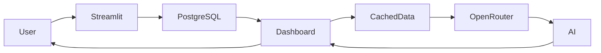

---

# Intelligent Site Services Copilot

An operations intelligence dashboard for a site-services company that combines **business dashboards**, **real-time operational KPIs**, and an **AI business analyst** capable of answering natural-language questions about the company's current performance.

Instead of querying the database directly, the AI analyzes curated operational datasets already loaded by the application, providing insights, trend analysis and recommendations while remaining isolated from the production database.

Built as a portfolio project demonstrating applied LLM engineering, dashboard design, data visualization, secure cloud deployment, and AI-assisted business intelligence.

**Live demo**

[https://site-services-copilot-866129993555.us-central1.run.app](https://site-services-copilot-866129993555.us-central1.run.app)

---
## DEMO


## Features

### Operational Dashboard

* Equipment availability
* Maintenance overview
* Active and overdue projects
* Pending permits
* Low inventory alerts
* Aggregate sales revenue
* Revenue per project
* Notification center with operational alerts

---

### Business Intelligence

Interactive dashboards built with Plotly covering:

* Revenue by service category
* Monthly aggregate revenue
* Top clients
* Equipment utilization
* Crew workload
* Aggregate inventory
* Historical pricing
* Project portfolio
* Permit status

---

### AI Business Analyst

The application includes an AI assistant powered through OpenRouter.

Users can ask questions such as:

* "What's the overall state of the business today?"
* "Which operational area needs immediate attention?"
* "Show me the revenue trend."
* "Which equipment should be prioritized?"

The assistant:

* analyzes the current dashboard data
* produces business insights
* recommends actions
* automatically generates charts when appropriate

Rather than giving the model database access, the application provides structured business datasets already loaded from PostgreSQL.

This significantly reduces hallucination risk while improving security.

---

## Architecture



---

## Tech Stack

| Layer            | Technology                                              |
| ---------------- | ------------------------------------------------------- |
| Frontend         | Streamlit                                               |
| Charts           | Plotly Express                                          |
| Data Processing  | pandas                                                  |
| Database         | PostgreSQL 16                                           |
| ORM / DB         | SQLAlchemy                                              |
| Production DB    | Cloud SQL                                               |
| Cloud Connector  | Cloud SQL Python Connector                              |
| AI               | OpenRouter                                              |
| Supported Models | GPT-4o Mini, Claude 3.5 Sonnet, Gemini Flash, Llama 3.1 |
| Deployment       | Google Cloud Run                                        |
| Secrets          | Secret Manager                                          |

---

## AI Architecture

Unlike database-connected LLM agents, this application follows a safer pattern.

```
Database

↓

Aggregated SQL Queries

↓

Pandas DataFrames

↓

Business Context

↓

OpenRouter LLM

↓

Business Insights
```

The language model never executes SQL.

Instead, it receives:

* KPI summaries
* aggregated datasets
* sampled business tables

This design greatly reduces the attack surface while allowing high-quality analytical responses.

---

## Security

The project follows multiple security layers.

### Read-only database

The application connects using a dedicated PostgreSQL user with read-only permissions.

### Cached queries

Business indicators are cached to avoid unnecessary database access.

### Environment variables

Credentials are injected through environment variables or Secret Manager.

### Cloud SQL Connector

Production uses IAM-authenticated encrypted connections without exposing a public database endpoint.

### AI Isolation

The LLM has **no direct database access**.

It only receives structured business context generated by the application.

---

## Dashboard Sections

### Home

Operational control center containing:

* KPIs
* alerts
* notifications
* inventory monitoring
* operational health
* revenue overview

---

### Business Intelligence

Dedicated analytics page containing:

* interactive Plotly dashboards
* historical analysis
* customer analytics
* equipment metrics
* financial metrics

---

### AI Assistant

Conversational interface where managers can ask natural-language questions about current business performance.

The assistant can also request automatic chart generation.

---

## Database

The application uses nine relational tables:

```
clients

projects

permits

equipment

service_categories

service_requests

aggregates

aggregate_orders

aggregate_price_history
```

Seed data models a real site-services company including:

* excavation
* drilling
* septic systems
* water services
* landscaping
* aggregate sales

---

## Running Locally

```bash
git clone <repo>

cd intelligent-site-services-copilot

pip install -r requirements.txt

docker compose up -d

streamlit run app.py
```

By default the application connects to a local PostgreSQL instance.

---

## Deployment

The application is containerized and deployed on Google Cloud Run.

Production features include:

* Cloud SQL
* Secret Manager
* IAM service account
* Cloud SQL Connector
* automatic scaling

---

## Design Decisions

### Dashboard-first architecture

Instead of allowing an LLM to generate SQL, the application loads business datasets through curated SQL queries and exposes them to the AI.

Benefits:

* safer
* deterministic
* lower latency
* easier caching
* predictable costs

---

### Automatic chart generation

The AI can optionally emit a small JSON specification describing a chart.

The application validates that specification and renders the visualization using Plotly.

This allows the LLM to request visualizations without generating executable code.

---

### Cached KPIs

Dashboard metrics are cached using Streamlit's caching layer to minimize repeated database queries.

---

### Multi-model AI

OpenRouter allows switching between several models without changing application code.

Supported examples include:

* GPT-4o Mini
* Claude 3.5 Sonnet
* Gemini Flash
* Llama 3.1

---

## Future Improvements

* Conversation memory
* Authentication
* User-specific dashboards
* Role-based permissions
* Forecasting models
* Export to PDF/Excel
* Scheduled reports
* Natural-language filtering
* Time-series forecasting
* Real-time streaming metrics

---

